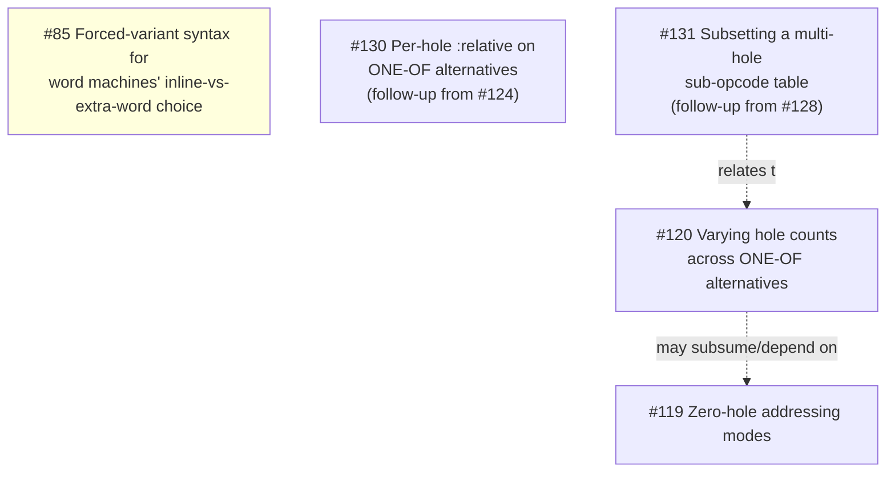

# Tickets

Planned work is tracked at [todo.sr.ht/~takeiteasy/lasm](https://todo.sr.ht/~takeiteasy/lasm),
grouped into milestones (`M2`–`M7`). This page tracks *dependencies between
open tickets* within a milestone, so work can be sequenced correctly — it is
not a mirror of ticket content; read the ticket itself for that.

Only milestones with tracked dependency graphs appear below. A milestone
with no graph yet just means no one has built one — check the tracker
directly for its open tickets.

## M4: word-encoding, byte-machine sub-opcodes, ONE-OF refinements

Most M4 backlog tickets are independent (each fixes a distinct follow-up
noted while implementing an already-landed feature — #20 bitfield/variant
encoding, #53 cell-width-typed output, #103 `one-of`, #104 mode-selected
field codes, #13/#54/#55 banked registers). The exceptions form one real
dependency chain, plus a couple of loose couplings:

#123 (decode discriminator design), #125 (its implementation, the
byte-machine sub-opcode cell), #126 (hole-selected sub-opcode, the byte
analogue of #104's `(choice mode)`), #122 (`choice-case` dispatch on a
cell-encoded machine's `one-of` alternative, unblocked by and closed
alongside #126), #124/#127 (per-hole `:signed` on `one-of` alternatives,
both encoding schemes), #128 (multi-hole sub-opcode selection, lifting
#126's one-carrying-hole cap via an explicit `(sub-opcode ...)` combination
table, and #124's matching cap on disagreeing-signedness holes alongside
it), and #129 (per-hole `:width` on byte-encoded machines) have all landed.
#129's own gate — `%layout`'s monotone-widening FLOOR fixpoint tolerating a
per-hole operand size — turned out narrower than its original phrasing
suggested: a sub-opcode-selected sibling is chosen by *syntax* alone
(`%choices-eligible-p`, before any value ever folds), and syntax is
pass-invariant, so the chosen sibling's size is already constant on the
first relaxation pass, with nothing for the FLOOR fixpoint to widen — see
[Assembler, "Choosing a mode"](assembler.md#choosing-a-mode). This does
*not* carry over to #120 below, whose own problem (alternatives of one
`one-of` binding a *different number* of holes) is structural, not a sizing
question the eligibility argument resolves. `:relative` split into its own
ticket, #130 (whose gate — needing `:signed`'s decode-time discriminator
first — #124/#127 already opened; its remaining open question is which
hole of a multi-hole pattern is the relative one), and `:suffix` folds into
#85 rather than getting its own ticket. #131 (subsetting a multi-hole
sub-opcode table, filed as a follow-up while implementing #128: today every
`one-of` hole of a mode must participate in a `(sub-opcode ...)` table,
with no way to have only some of them discriminate) is worth reading
together with #120, which touches the same `one-of` hole-identity
assumptions — and, since #129 landed, #131 also means a mode with an
unrelated extra `one-of` hole must enumerate the full cross product just to
give one hole its own per-hole `:width`.

Other open M4 tickets and what they follow up on (no blocking dependency
between them or on the chain above):

| Ticket | Follows up on |
|---|---|
| #62 word-encoded `:relative` mode | #20 |
| #63 word-encoding polish (extra-word width, signed gap, memoization, overlap check) | #20 |
| #64 non-uniform instruction-word layouts | #20, concrete case from #54 |
| #65 `.cell`/`.dat` directive | #53 |
| #66 `:endian` option | #53 |
| #67 `lo`/`hi` operators vs. cell width | #53 |
| #68 `mref` read-path masking | #53 |
| #69 dead cell-width fallback in `storage.lisp` | #53 |
| #70 step loop re-resolves cell-width every step | #53 (same shape as #39) |
| #72 symbolic names for banked register elements | #13, #54, #55 |
| #114 architecture → CPU family → CPU model tiering | independent (mirrors old rpg/ANIMA-16 tiering) |
| #116 per-hole ambiguity warning for ONE-OF | #74, #103; neighbors #115/#123/#124 but not blocked by them |

## Adding to this page

When a new ticket explicitly says it depends on, is blocked by, or is a
prerequisite for another, add or update the relevant milestone's graph. A
"follows up on" / "noted while implementing" relationship is *not* a
blocking dependency and belongs in the plain table instead.
