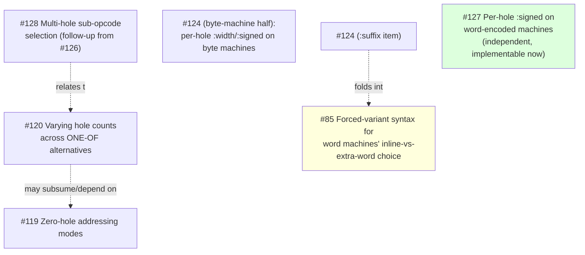

# Tickets

Planned work is tracked at [todo.sr.ht/~takeiteasy/lasm](https://todo.sr.ht/~takeiteasy/lasm),
grouped into milestones (`M2`–`M7`). This page tracks *dependencies between
open tickets* within a milestone, so work can be sequenced correctly — it is
not a mirror of ticket content; read the ticket itself for that.

Only milestones with tracked dependency graphs appear below. A milestone
with no graph yet just means no one has built one — check the tracker
directly for its open tickets.

## M4: word-encoding, byte-machine sub-opcodes, ONE-OF refinements

Most M4 backlog tickets are independent (each fixes a distinct follow-up
noted while implementing an already-landed feature — #20 bitfield/variant
encoding, #53 cell-width-typed output, #103 `one-of`, #104 mode-selected
field codes, #13/#54/#55 banked registers). The exceptions form one real
dependency chain, plus a couple of loose couplings:

#123 (decode discriminator design), #125 (its implementation, the
byte-machine sub-opcode cell), #126 (hole-selected sub-opcode, the byte
analogue of #104's `(choice mode)`), and #122 (`choice-case` dispatch on a
cell-encoded machine's `one-of` alternative, unblocked by and closed
alongside #126) have all landed. #124's byte-machine half (`:width`/
`:signed` per `one-of` alternative) is next — the per-hole decode record it
needed now exists. #128 (multi-hole sub-opcode selection, filed as a
follow-up while implementing #126: today at most one hole per mode may
carry a sub selector) is worth reading together with #120. #127
(word-machine `:signed`) remains independent of this chain and can be
picked up at any time.

Other open M4 tickets and what they follow up on (no blocking dependency
between them or on the chain above):

| Ticket | Follows up on |
|---|---|
| #62 word-encoded `:relative` mode | #20 |
| #63 word-encoding polish (extra-word width, signed gap, memoization, overlap check) | #20 |
| #64 non-uniform instruction-word layouts | #20, concrete case from #54 |
| #65 `.cell`/`.dat` directive | #53 |
| #66 `:endian` option | #53 |
| #67 `lo`/`hi` operators vs. cell width | #53 |
| #68 `mref` read-path masking | #53 |
| #69 dead cell-width fallback in `storage.lisp` | #53 |
| #70 step loop re-resolves cell-width every step | #53 (same shape as #39) |
| #72 symbolic names for banked register elements | #13, #54, #55 |
| #114 architecture → CPU family → CPU model tiering | independent (mirrors old rpg/ANIMA-16 tiering) |
| #116 per-hole ambiguity warning for ONE-OF | #74, #103; neighbors #115/#123/#124 but not blocked by them |

## Adding to this page

When a new ticket explicitly says it depends on, is blocked by, or is a
prerequisite for another, add or update the relevant milestone's graph. A
"follows up on" / "noted while implementing" relationship is *not* a
blocking dependency and belongs in the plain table instead.
