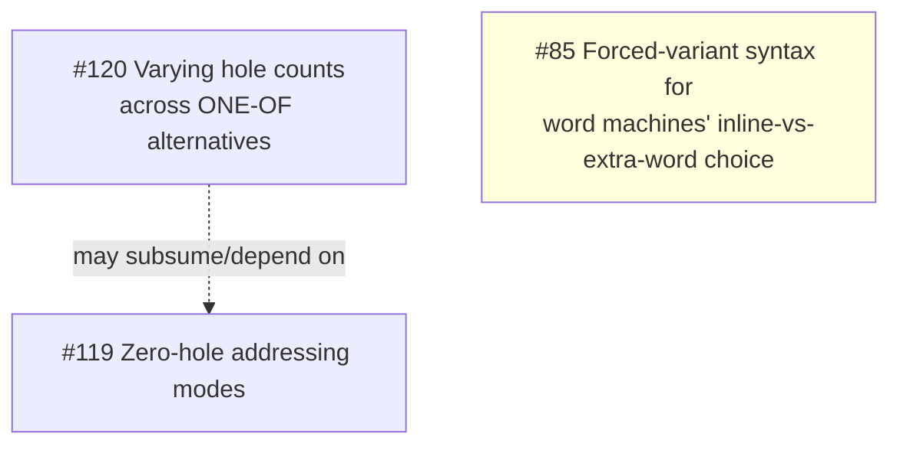

# Tickets

Planned work is tracked at [todo.sr.ht/~takeiteasy/lasm](https://todo.sr.ht/~takeiteasy/lasm),
grouped into milestones (`M2`–`M7`). This page tracks *dependencies between
open tickets* within a milestone, so work can be sequenced correctly — it is
not a mirror of ticket content; read the ticket itself for that.

Only milestones with tracked dependency graphs appear below. A milestone
with no graph yet just means no one has built one — check the tracker
directly for its open tickets.

## M4: word-encoding, byte-machine sub-opcodes, ONE-OF refinements

Most M4 backlog tickets are independent (each fixes a distinct follow-up
noted while implementing an already-landed feature — #20 bitfield/variant
encoding, #53 cell-width-typed output, #103 `one-of`, #104 mode-selected
field codes, #13/#54/#55 banked registers). The exceptions form one real
dependency chain, plus a couple of loose couplings:

#123 (decode discriminator design), #125 (its implementation, the
byte-machine sub-opcode cell), #126 (hole-selected sub-opcode, the byte
analogue of #104's `(choice mode)`), #122 (`choice-case` dispatch on a
cell-encoded machine's `one-of` alternative, unblocked by and closed
alongside #126), #124/#127 (per-hole `:signed` on `one-of` alternatives,
both encoding schemes), #128 (multi-hole sub-opcode selection, lifting
#126's one-carrying-hole cap via an explicit `(sub-opcode ...)` combination
table, and #124's matching cap on disagreeing-signedness holes alongside
it), #129 (per-hole `:width` on byte-encoded machines), #130 (per-hole
`:relative`, the last of #124's four split-off attributes), #131
(subsetting a multi-hole sub-opcode table), #132 (a whole-mode `:signed t`
mode whose single hole is a `one-of` silently dropping that `:signed t`),
and #133 (the `:signed`/`:relative`-at-one-hole composition #130 left
unverified) have all landed. #129's own gate — `%layout`'s monotone-widening
FLOOR fixpoint tolerating a per-hole operand size — turned out narrower than
its original phrasing suggested: a sub-opcode-selected sibling is chosen by
*syntax* alone (`%choices-eligible-p`, before any value ever folds), and
syntax is pass-invariant, so the chosen sibling's size is already constant
on the first relaxation pass, with nothing for the FLOOR fixpoint to widen —
see [Assembler, "Choosing a mode"](assembler.md#choosing-a-mode). This does
*not* carry over to #120 below, whose own problem (alternatives of one
`one-of` binding a *different number* of holes) is structural, not a sizing
question the eligibility argument resolves. #130's own gate — needing
`:signed`'s decode-time discriminator first — #124/#127 already opened;
what it needed beyond `:signed` was a *positional* record (which hole, not
just whether some hole is relative), a shape `operand-signedness`'s
per-hole boolean list had no room for, so it got its own
`relative-hole-index` descriptor slot rather than reusing that one. Landing
it also unifies a whole-mode `relative` mode onto the same slot (always
hole 0), so every consumer — the assembler's fit filter/`%encode`, the
strict-range check, and the disassembler's rendering (the one surface
#124/#127/#129 never touched, since all three were pure encode/decode-value
changes) — reads one uniform record instead of branching on
`mode-descriptor-relativep` separately. `:suffix` folds into #85 rather than
getting its own ticket. #131 added an optional leading `(holes h1 h2 ...)`
form inside `(sub-opcode ...)`, naming by 0-based pattern-order index which
of the mode's `one-of` holes a table covers — an uncovered `one-of` hole
gets no decode-time record, same as before #128 existed, so its own
alternatives must already agree; the indices are sorted into ascending
pattern order internally regardless of how they're written, so `(choice
...)` inside the table stays positional in pattern order rather than
`(holes ...)`'s own writing order. It remains worth reading together with
#120, which touches the same `one-of` hole-identity assumptions, but is no
longer itself blocking anything. #132 folded its check into the same
`%check-mode-hole-attributes` function (renamed from
`%check-relative-mode-holes`) #130 added for the equivalent `:relative`
hazard, rather than a new sibling function, so the two can never be
sequenced wrong at either call site. #133 confirmed `:signed` and
`:relative` disagreeing independently at one shared-selector hole composes
cleanly (verified by encode/decode round trip, not just slot values), and
that the further three-way `:signed`/`:width`/`:relative` disagreement at
one hole also composes cleanly with no new machinery, closing the
"composes for free" question #130's own closing comment and #131's ticket
both left open.

Other open M4 tickets and what they follow up on (no blocking dependency
between them or on the chain above):

| Ticket | Follows up on |
|---|---|
| #135 per-field extra-word width on a word-encoded machine | #20, split off #63 |
| #140 relax #64's same-layout-per-opcode restriction | #105, #64, unblocked by #137 |
| #65 `.cell`/`.dat` directive | #53 |
| #66 `:endian` option | #53 |
| #67 `lo`/`hi` operators vs. cell width | #53 |
| #68 `mref` read-path masking | #53 |
| #69 dead cell-width fallback in `storage.lisp` | #53 |
| #70 step loop re-resolves cell-width every step | #53 (same shape as #39) |
| #72 symbolic names for banked register elements | #13, #54, #55 |
| #114 architecture → CPU family → CPU model tiering | independent (mirrors old rpg/ANIMA-16 tiering) |
| #134 `:strict` has no effect on a word-encoded machine's non-relative holes | #20, noted while implementing #62 |
| #116 per-hole ambiguity warning for ONE-OF | #74, #103; neighbors #115/#123/#124 but not blocked by them |

#63 (word-encoding polish: extra-word width, signed gap, memoization,
overlap check) is now closed -- its signed gap, memoization, and overlap
check landed together (the overlap check turned out already covered by
#104/#127, only lacking a regression test); its extra-word-width item split
off to #135 above, being by far the largest of the four and needing its own
syntax design.

#64 (per-instruction, non-uniform instruction-word layouts) is now closed --
named `(layout NAME ...)` alternates share the machine's `:width` and
`opcode` field, and a `definstruction` selects one via a `(layout NAME)`
encoding subclause. Scoped to layout *selection*; a nibble-faithful CHIP8
also needed constant discriminator fields (no operand hole, a field pinned
to a literal), split off to #136. It also surfaced two further gaps, both
since closed: #137 (`%hole-disjoint-p`'s caller compared co-tenant holes
positionally instead of by the bits they occupy -- pre-existing, exposed
by this ticket's own co-tenancy check) and #138 (`(operand ... :field
opcode)` silently corrupted the opcode field at encode time -- pre-existing
on every word-encoded machine). #137's fix leaves the same-layout-per-opcode
restriction itself no longer load-bearing; relaxing it is #140.

#136 (word-encoded constant discriminator fields) is now closed --
`(field-value FIELD-NAME n)` pins an instruction-word field to a literal
with no operand hole, participating in `%check-opcode-decodable!`'s
co-tenancy check the same way a hole's raw bits already do.
`examples/chip8word.lisp` is nibble-faithful for every CHIP8 opcode family
this needed (`8XY_`, `5XY0`/`9XY0`, `EX9E`/`EXA1`, `FX__`, `00E0`/`00EE`)
except `0NNN`, which cannot coexist with `00E0`/`00EE` under disjointness
alone -- filed as #139, needing priority/ordering semantics between
co-tenants instead.

## Adding to this page

When a new ticket explicitly says it depends on, is blocked by, or is a
prerequisite for another, add or update the relevant milestone's graph. A
"follows up on" / "noted while implementing" relationship is *not* a
blocking dependency and belongs in the plain table instead.
